# Flowchart: Ancillary Market (AM) Operation

## VPP Participation in Fast Frequency Response for Islanded Microgrid

```mermaid
graph TD
    Start((Start)) --> Stage1_AM

    subgraph Stage1_AM ["STAGE ONE: DAY-AHEAD RESERVE SCHEDULING"]
        AM1_Input[/"<b>Inputs:</b><br/>• DER availability forecast (PV, Wind, BESS, EVCS)<br/>• SOC projections and charging schedules<br/>• Expected frequency disturbance scenarios<br/>• Network topology and GFM asset locations<br/>• Minimum reserve margin requirements"/]
        
        AM1_Cap["<b>Estimate Reserve Capability per VPP:</b><br/>• Upward reserve capacity (MW)<br/>• Downward reserve capacity (MW)<br/>• Ramp rate capability (MW/s)<br/>• Available inertia contribution (MWs)"]
        
        AM1_Agg["<b>Aggregate at VPP Level:</b><br/>• Sum available FFR capacity across DERs<br/>• Compute VPP-level droop coefficient range<br/>• Assess combined BESS + EVCS flexibility"]
        
        AM1_Bid["<b>Formulate Reserve Bid:</b><br/>• FFR capacity offer (MW)<br/>• Activation price (€/MW)<br/>• Response time guarantee (seconds)"]
        
        AM1_Submit[/"Submit FFR Reserve Bid<br/>to Microgrid Operator"/]
        
        AM1_Clear{"Reserve<br/>Clearing"}
        
        AM1_Award[/"Receive Cleared Reserve:<br/>• Committed FFR capacity<br/>• Reserve payment rate"/]
        
        AM1_Feasible{"Network Feasibility<br/>Check"}
        
        AM1_Refine["<b>Refine Portfolio:</b><br/>• Reduce reserve at congested nodes<br/>• Shift capacity to stronger buses<br/>• Re-allocate among VPP assets"]
        
        AM1_Input --> AM1_Cap
        AM1_Cap --> AM1_Agg
        AM1_Agg --> AM1_Bid
        AM1_Bid --> AM1_Submit
        AM1_Submit --> AM1_Clear
        AM1_Clear --> AM1_Award
        AM1_Award --> AM1_Feasible
        AM1_Feasible -- No --> AM1_Refine
        AM1_Refine --> AM1_Agg
    end

    AM1_Feasible -- Yes --> Stage2_AM

    subgraph Stage2_AM ["STAGE TWO: REAL-TIME FFR ACTIVATION"]
        AM2_Monitor[/"<b>Continuous Monitoring:</b><br/>• Frequency deviation (Δf)<br/>• Rate of Change of Frequency (RoCoF)<br/>• System inertia state (H_sys)"/]
        
        AM2_Trigger{"<b>FFR Activation?</b><br/>|Δf| > 0.1 Hz<br/>or |RoCoF| > 0.5 Hz/s"}
        
        AM2_Allocate["<b>VPP Controller - Response Allocation:</b><br/>• Distribute FFR requirement among assets<br/>• Consider SOC levels and availability<br/>• Prioritize fast-responding BESS units"]
        
        AM2_Feasible2{"Asset Constraints<br/>Satisfied?"}
        
        AM2_Realloc["<b>Re-allocate Response:</b><br/>• Shift load to available assets<br/>• Activate backup resources<br/>• Update droop coefficients"]
        
        AM2_Execute["<b>Local DER Control:</b><br/>• Apply droop response: ΔP = -k_droop × Δf<br/>• BESS fast charge/discharge<br/>• EVCS V2G activation<br/>• GFM inverter power injection"]
        
        AM2_Feedback[/"<b>Feedback from DERs:</b><br/>• Actual power delivered<br/>• Updated SOC status<br/>• Residual capacity available"/]
        
        AM2_Verify{"Response Within<br/>Tolerance?"}
        
        AM2_Compensate["<b>Compensate Shortfall:</b><br/>• Activate additional assets<br/>• Increase droop gain<br/>• Request peer VPP support"]
        
        AM2_Stable{"Frequency<br/>Stabilized?"}
        
        AM2_Sustain["<b>Sustain Response:</b><br/>• Maintain power injection<br/>• Monitor SOC depletion<br/>• Prepare for recovery phase"]
        
        AM2_Settlement["<b>Settlement:</b><br/>• FFR energy delivered (MWh)<br/>• Response quality score<br/>• Reserve availability payment<br/>• Activation energy payment<br/>• Penalty/bonus calculation"]
        
        AM2_Update[/"Update Models:<br/>• Revise availability forecasts<br/>• Update SOC trajectories<br/>• Prepare for next interval"/]

        AM2_Monitor --> AM2_Trigger
        AM2_Trigger -- No --> AM2_Monitor
        AM2_Trigger -- Yes --> AM2_Allocate
        AM2_Allocate --> AM2_Feasible2
        AM2_Feasible2 -- No --> AM2_Realloc
        AM2_Realloc --> AM2_Allocate
        AM2_Feasible2 -- Yes --> AM2_Execute
        AM2_Execute --> AM2_Feedback
        AM2_Feedback --> AM2_Verify
        AM2_Verify -- No --> AM2_Compensate
        AM2_Compensate --> AM2_Allocate
        AM2_Verify -- Yes --> AM2_Stable
        AM2_Stable -- No --> AM2_Sustain
        AM2_Sustain --> AM2_Execute
        AM2_Stable -- Yes --> AM2_Settlement
        AM2_Settlement --> AM2_Update
    end

    AM2_Update --> End((End))

    style Stage1_AM fill:#e6f2ff,stroke:#0066cc,stroke-width:2px
    style Stage2_AM fill:#fff2e6,stroke:#cc6600,stroke-width:2px
```

---

## Stage Descriptions

### Stage One: Day-Ahead Reserve Scheduling
The VPP aggregator assesses available flexibility from distributed energy resources and formulates FFR reserve bids for the ancillary market. Network feasibility is verified to ensure committed reserves can be delivered without violating distribution constraints.

### Stage Two: Real-Time FFR Activation
Upon detecting frequency deviation beyond threshold, the VPP controller allocates response among DERs based on availability and SOC status. Local controllers execute droop-based power injection. Performance is tracked and settlement is processed based on delivered response quality.

---

## Key Parameters

| Parameter | Symbol | Typical Value | Description |
|-----------|--------|---------------|-------------|
| Activation threshold | ε_f | 0.1 Hz | Frequency deviation to trigger FFR |
| RoCoF threshold | ε_RoCoF | 0.5 Hz/s | Rate of change threshold |
| Droop coefficient | k_droop | 0.02-0.10 MW/Hz | VPP-level response gain |
| Response time | t_resp | < 2 s | Time to reach full response |
| Sustain duration | t_sustain | 30 s | Minimum response duration |
