# Flowchart: Energy Market (EM) Operation

## VPP Participation in Peer-to-Peer Energy Trading for Islanded Microgrid

```mermaid
graph TD
    Start((Start)) --> Stage1_EM

    subgraph Stage1_EM ["STAGE ONE: DAY-AHEAD ENERGY SCHEDULING"]
        EM1_Input[/"<b>Inputs:</b><br/>• Load forecast per zone (24h)<br/>• RES generation forecast (PV, Wind)<br/>• BESS SOC and capacity<br/>• EVCS charging demand<br/>• Zonal prices from DSO"/]
        
        EM1_Opt["<b>VPP Energy Optimization:</b><br/>• Maximize self-consumption of RES<br/>• Schedule BESS charging (low price) / discharging (high price)<br/>• Plan EVCS charging under user constraints<br/>• Minimize energy procurement cost"]
        
        EM1_DRO["<b>Distributionally Robust Bidding:</b><br/>• Account for RES uncertainty<br/>• Worst-case expected profit<br/>• Risk-aware scheduling"]
        
        EM1_Agg["<b>Aggregate VPP Position:</b><br/>• Net energy buy/sell per interval<br/>• Flexibility margin for real-time adjustment<br/>• Inter-zone P2P trading offers"]
        
        EM1_Submit[/"Submit Energy Schedule<br/>to Market Operator"/]
        
        EM1_Clear{"Market<br/>Clearing"}
        
        EM1_Award[/"Receive Cleared Schedule:<br/>• Committed energy (MWh per interval)<br/>• Settlement prices per zone"/]
        
        EM1_Feasible{"Network Feasibility<br/>& Power Flow Check"}
        
        EM1_Refine["<b>Adjust Schedule:</b><br/>• Reduce exchange at congested lines<br/>• Shift load to off-peak intervals<br/>• Revise inter-zone trades"]
        
        EM1_Input --> EM1_Opt
        EM1_Opt --> EM1_DRO
        EM1_DRO --> EM1_Agg
        EM1_Agg --> EM1_Submit
        EM1_Submit --> EM1_Clear
        EM1_Clear --> EM1_Award
        EM1_Award --> EM1_Feasible
        EM1_Feasible -- No --> EM1_Refine
        EM1_Refine --> EM1_Agg
    end

    EM1_Feasible -- Yes --> Stage2_EM

    subgraph Stage2_EM ["STAGE TWO: REAL-TIME ENERGY DISPATCH"]
        EM2_Receive[/"<b>Receive Operating Interval:</b><br/>• Cleared energy schedule<br/>• Current zonal prices<br/>• Updated RES forecast"/]
        
        EM2_Update["<b>Update State:</b><br/>• Actual RES generation<br/>• Current SOC levels<br/>• Real-time load measurement"]
        
        EM2_Deviation{"Deviation from<br/>Schedule?"}
        
        EM2_Dispatch["<b>VPP Rolling Optimization:</b><br/>• Minimize deviation from DA schedule<br/>• Re-optimize remaining intervals<br/>• Update asset setpoints"]
        
        EM2_Allocate["<b>Dispatch to DERs:</b><br/>• BESS charge/discharge setpoints<br/>• EVCS power allocation<br/>• PV/Wind curtailment (if needed)"]
        
        EM2_Execute["<b>Local DER Control:</b><br/>• Execute power setpoints<br/>• Manage SOC trajectories<br/>• Voltage/reactive power control"]
        
        EM2_Feedback[/"<b>Feedback from DERs:</b><br/>• Actual power delivered<br/>• SOC updates<br/>• Constraint violations"/]
        
        EM2_Constraint{"Local Constraints<br/>Satisfied?"}
        
        EM2_Adjust["<b>Adjust Locally:</b><br/>• Shift load among assets<br/>• Curtail non-critical loads<br/>• Request flexibility from other VPPs"]
        
        EM2_Track{"Schedule<br/>Tracking OK?"}
        
        EM2_Imbalance["<b>Imbalance Handling:</b><br/>• Calculate deviation penalty<br/>• Procure balancing energy<br/>• Update remaining schedule"]
        
        EM2_Settlement["<b>Settlement:</b><br/>• Energy delivered (MWh)<br/>• P2P trading revenue<br/>• Imbalance penalties<br/>• Network usage charges<br/>• Net VPP energy revenue"]
        
        EM2_Learn[/"Update Models:<br/>• Improve RES forecast<br/>• Refine load prediction<br/>• Prepare next interval"/]

        EM2_Receive --> EM2_Update
        EM2_Update --> EM2_Deviation
        EM2_Deviation -- No --> EM2_Allocate
        EM2_Deviation -- Yes --> EM2_Dispatch
        EM2_Dispatch --> EM2_Allocate
        EM2_Allocate --> EM2_Execute
        EM2_Execute --> EM2_Feedback
        EM2_Feedback --> EM2_Constraint
        EM2_Constraint -- No --> EM2_Adjust
        EM2_Adjust --> EM2_Dispatch
        EM2_Constraint -- Yes --> EM2_Track
        EM2_Track -- No --> EM2_Imbalance
        EM2_Imbalance --> EM2_Dispatch
        EM2_Track -- Yes --> EM2_Settlement
        EM2_Settlement --> EM2_Learn
    end

    EM2_Learn --> End((End))

    style Stage1_EM fill:#e6ffe6,stroke:#006600,stroke-width:2px
    style Stage2_EM fill:#ffe6f0,stroke:#cc0066,stroke-width:2px
```



---

## Stage Descriptions

### Stage One: Day-Ahead Energy Scheduling
The VPP aggregator optimizes energy procurement and trading based on forecasted generation, load, and zonal prices. Distributionally robust optimization handles RES uncertainty. Network feasibility ensures schedules respect distribution constraints.

### Stage Two: Real-Time Energy Dispatch
During operation, the VPP tracks its committed schedule while adapting to actual conditions. Deviations trigger re-optimization. Local controllers execute setpoints while respecting asset constraints. Imbalances are settled with appropriate penalties.

---

## Key Parameters

| Parameter | Symbol | Typical Value | Description |
|-----------|--------|---------------|-------------|
| Dispatch interval | Δt_slow | 15 min | Energy market interval |
| Imbalance tolerance | ε_E | 5% | Acceptable deviation |
| SOC limits | SOC_min/max | 10%/90% | BESS operating range |
| Curtailment cost | c_curt | 50 €/MWh | RES curtailment penalty |
| Imbalance price | λ_imb | 1.5× spot | Penalty multiplier |

---

## Revenue Calculation

```
R_EM = Σ(P_sell × λ_zone) - Σ(P_buy × λ_zone) - Penalty_imbalance - Cost_curtailment
```

Where:
- P_sell: Energy sold to other zones (MWh)
- P_buy: Energy purchased from other zones (MWh)  
- λ_zone: Zonal price (€/MWh)
- Penalty_imbalance: Deviation from schedule (€)
- Cost_curtailment: RES curtailment cost (€)
