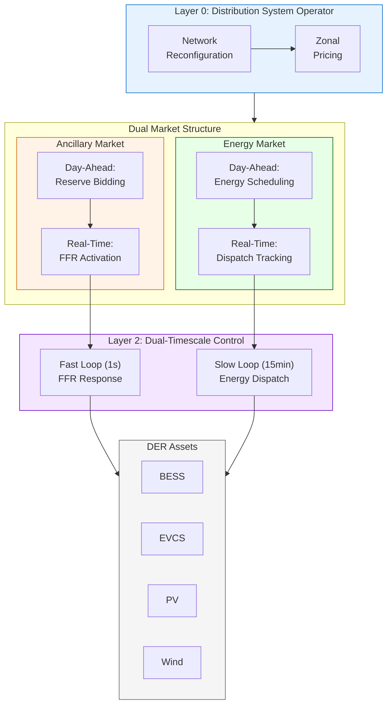
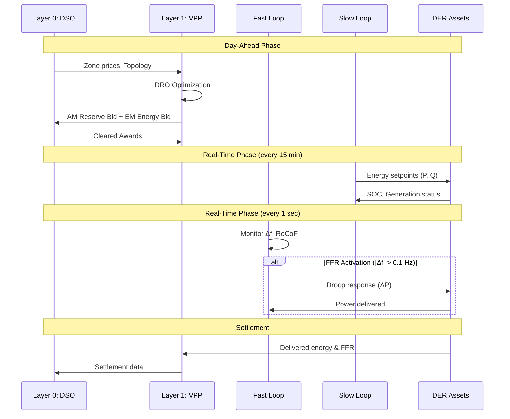

# VPP Operation Framework Overview

## Dual-Market Participation: AM + EM Integration

---

## Timescale Separation

| Market | Timescale | Control Loop | Primary Objective |
|--------|-----------|--------------|-------------------|
| **AM** | 1 second | Fast (π_fast) | Frequency stability |
| **EM** | 15 minutes | Slow (π_slow) | Energy balance & profit |

---

## Coordination Mechanism

---

## File References

| Flowchart | File | Description |
|-----------|------|-------------|
| AM Operation | `docs/flowchart_AM.md` | Ancillary market FFR participation |
| EM Operation | `docs/flowchart_EM.md` | Energy market P2P trading |
| Overview | `docs/flowchart_overview.md` | This file - integration view |
