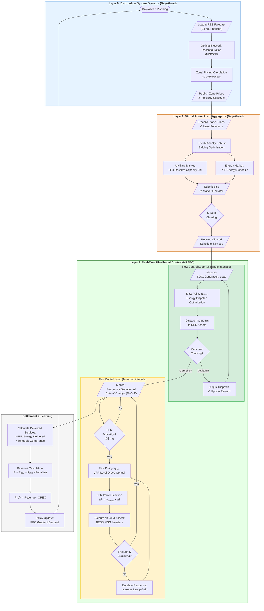
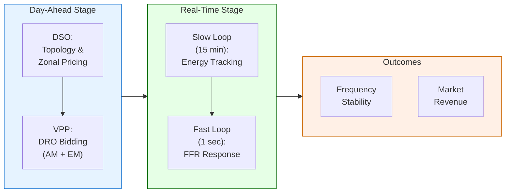

# Tri-Layer VPP Operation Framework for Islanded Microgrid with Ancillary Services

## Flowchart for Paper

---

## Simplified Version (Single-Page)

---

## Notation Table

| Symbol | Description | Unit |
|--------|-------------|------|
| Δf | Frequency deviation from nominal | Hz |
| RoCoF | Rate of Change of Frequency | Hz/s |
| ε_f | FFR activation threshold | Hz |
| k_droop | Droop coefficient per VPP | MW/Hz |
| π_slow | Slow-timescale policy (MAPPO) | - |
| π_fast | Fast-timescale policy (MAPPO) | - |
| R_AM | Ancillary market revenue | € |
| R_EM | Energy market revenue | € |
| OPEX | Operational expenditure | €/year |
| H_sys | System equivalent inertia constant | s |
| SOC | State of Charge | % |

---

## Key Innovations Highlighted

1. **Tri-Layer Hierarchical Control**
   - Layer 0: System-level optimization (DSO)
   - Layer 1: Market participation (VPP)
   - Layer 2: Real-time control (DERs)

2. **Dual-Timescale MAPPO**
   - Slow loop: Energy market tracking (15 min)
   - Fast loop: Ancillary service delivery (1 sec)

3. **VPP-Level FFR Aggregation**
   - Aggregate DER responses at VPP level
   - Reduce action space complexity
   - Market-realistic bidding unit

4. **Topology-Aware Frequency Dynamics**
   - H_sys adapts to network configuration
   - GFM/VSG assets provide virtual inertia

5. **Distributionally Robust Optimization**
   - Handle RES uncertainty in day-ahead
   - Worst-case expected profit maximization
